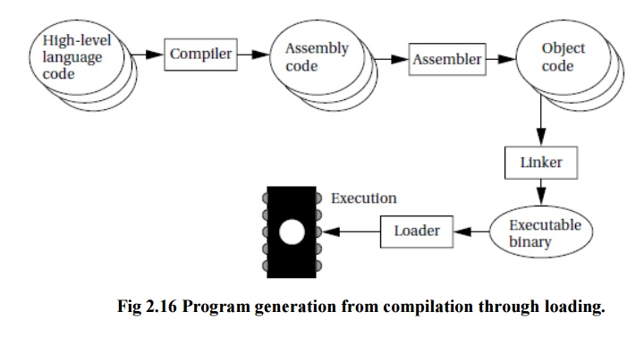

# 42_libasm 
어셈블러언어는 컴퓨터 또는 기타 프로그래밍 가능한 장치를 위한 저수준 프로그래밍 언어입니다. 
Assembler Language is a low-level programming language for computers or other programmable devices. 
이번 프로젝트의 목적은 기본적으로 어셈블리어를 이용하여 여러 함수를 구현해야합니다. 
The purpose of this project is basically to implement several functions using assembly language. 
  
**일반적으로 프로그램이 생성 및 실행되는 과정** 
**Typically the process by which a program is created and excuted** 
1. 프로그래머가 C, C++ 등의 언어로 프로그래밍을 하면 해당 언어의 컴파일러가 어셈블리 코드로 프로그램 코드를 변환합니다. 
When programmers program in a language such as C or C++, the language's compiler converts the program code into assembly code. 
2. 어셈블러는 컴파일러가 변환한 어셈블리 코드를 오브젝트 코드로변환합니다. 
the assembler converts assembly code converted by the compiler into object code. 
3. 링커는 어셈블러가 생성한 오브젝트 코드를 실제로 기계가 실행 가능한 바이너리 파일로 변환합니다. 
The linker converts the assembler-generated object code into actually machine-executable binary files. 
4. 로더는 링커가 생성한 실행 가능한 바이너리를 메모리에 로드합니다. 
The loader loads the executable binary generated by the linker into memory. 
5. 로더는 링커가 생성하 실행 가능한 바이너리를 메모리에 로드합니다. 
The loader loads the executable binary generated by the linker into memory.  
# Mandatory list: 
- [ ] ft_strlen 
- [ ] ft_strcpy 
- [ ] ft_strcmp 
- [ ] ft_write 
- [ ] ft_read 
- [ ] ft_strdup  
# Bonus list: 
- [ ] ft_atoi_base 
- [ ] ft_list_push_front 
- [ ] ft_list_size 
- [ ] ft_list_sort 
- [ ] ft_list_remove_if  
# Reference sites  
- <https://m.blog.naver.com/s2kiess/30181227661> - assembly learned. 
- <https://pol4.dev/x64-aseembly/>  
- <https://www.brainkart.com/article/Assembly-and-Linking_11818/> -aseembly linking 
- <https://phaphaya.tistory.com/23> - assembly foundation 
